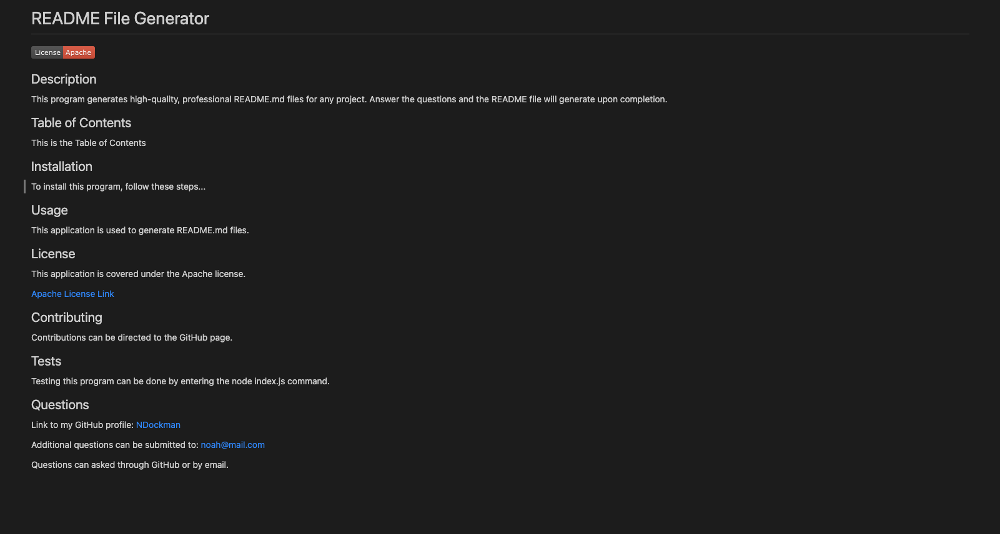

# pro-readme-generator

## Description
This application generates a customized README.md file based on user input. The readme generator allows a user to input whatever they want for each section of the readme. The different sections are description, Table of Contents, installation, usage, license, contributing, tests, and questions. A license badge appears near the top of the readme, and a license link directs to documentation for the chosen license. The objective of this program is to create a high-quality README.md file for any project.

## Link to walkthrough video

